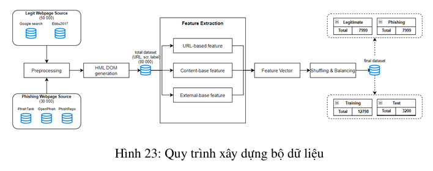
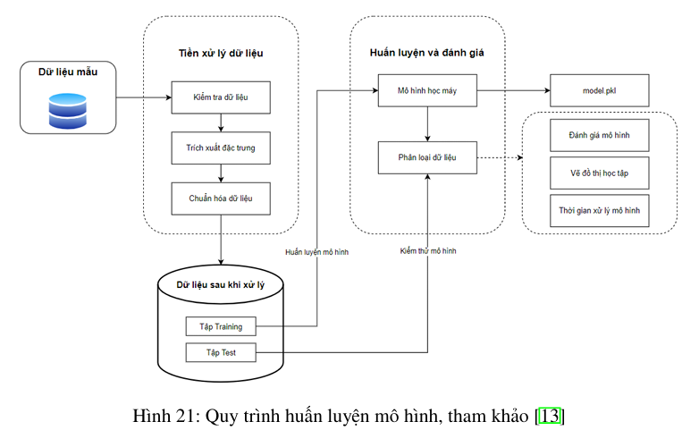
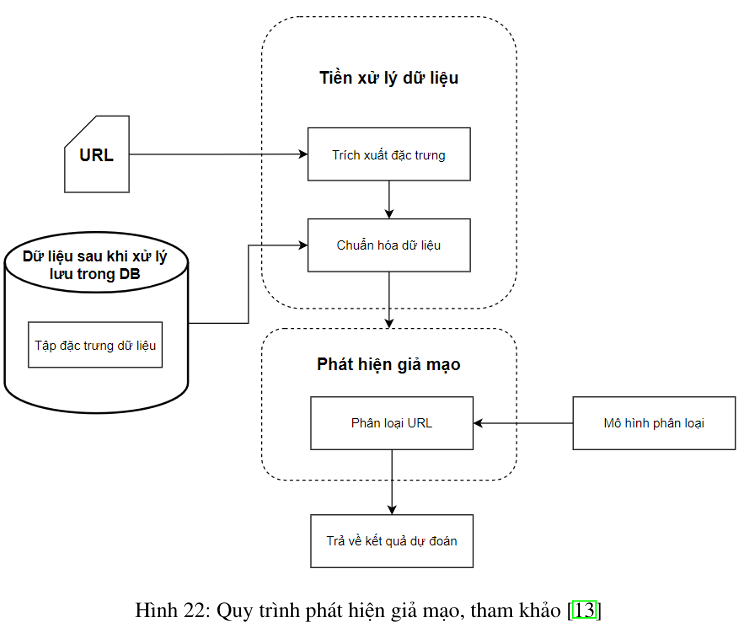
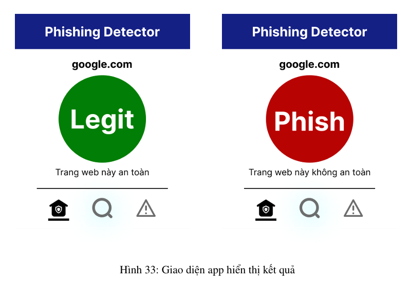

# Introduction 
Developed a phishing detection app that identifies fake websites designed to steal user information. The system uses machine learning to analyze website features and detect potential phishing threats, helping protect users from online scams.

# Step By Step
**1.	Data Collection and Preprocessing**
   

 * Gather data from multiple sources, including PhishTank and Kaggle.
 * Aggregate and filter features with high correlation to phishing characteristics.
 * Perform data balancing to improve model accuracy.
   
**2.	Machine Learning Model Developments**
   

 * Explore various machine learning models such as SVM, KNN, Logistic Regression, Decision Tree, and Random Forest.
 * Research and implement Ensemble Learning techniques for improved performance.
 * Compare models based on processing time, learning capability, and accuracy.

**3.	Application Development**

 * Define key functionalities required for the application.
 * Design a robust processing system for real-time phishing detection.
 * Deploy the application on Azure App Service for scalability and accessibility.

**4.	Evaluation and Testing**
 * Conduct feature testing to ensure all functionalities work as expected.
 * Measure response time to assess application stability and efficiency.
 * Gather user feedback to enhance usability and performance.
   
**5.	Final Report and Future Improvements**
 * Summarize key achievements and findings.
 * Highlight the system’s contributions to phishing prevention.
 * Identify potential future enhancements, including model optimization and expanded data sources.

# Result
The Web Phishing Detector App features a user-friendly interface that allows users to easily check the legitimacy of websites. The UI is designed for simplicity and efficiency, enabling seamless interaction with the phishing detection system.

This demo provides a clear overview of how the app operates, from detecting potential threats to delivering accurate insights for users:

https://github.com/user-attachments/assets/658cc5d2-6289-4944-94dc-f7ad16edf7db

# Contribute
## Data Engineer
* **An Pham** - *Initial work* - [AnNePDHA](https://github.com/AnNePDHA)
  * TODO: Explain how other users and developers can contribute to make your code better. 
